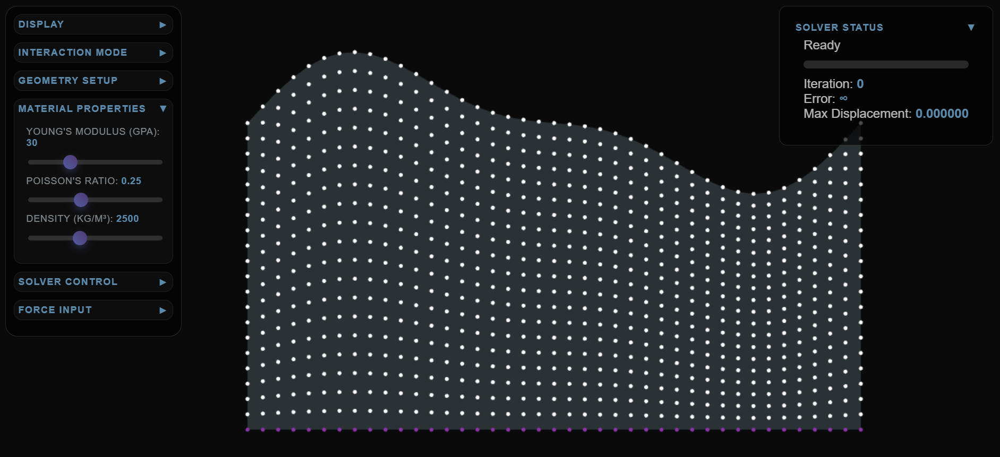

# Geomechanical Restoration - Interactive FEM

*Interactive finite element method visualization for geological restoration*

## Overview

This is an interactive 2D finite element method (FEM) application for geomechanical restoration of geological structures. Based on the techniques described by Maerten & Maerten (2006), this tool simulates the physical behavior of rock masses and considers heterogeneous material properties, bedding slip, and mechanical interaction of faults.

## Features

- **Interactive Geological Modeling**: Create simple and complex folded structures
- **Real-time FEM Solver**: Gauss-Seidel iterative solver with animation controls
- **Multiple Interaction Modes**:
  - Node selection and manipulation
  - Boundary condition setup (fixities)
  - Force application
  - Geological restoration targets
- **Material Property Controls**: Adjust Young's modulus, Poisson's ratio, and density
- **Solver Configuration**: Customize convergence criteria, iterations, and damping
- **3D Visualization**: Built with Three.js for smooth rendering and interaction

## Getting Started

### Prerequisites
- Modern web browser with WebGL support
- Local web server (for loading the application)

### Installation
1. Clone or download the repository
2. Ensure you have the compiled bundle at `dist/bundle.js`
3. Serve the files using a local web server
4. Open `index.html` in your browser

### Usage

1. **Create Geometry**: Use "Simple Fold" or "Complex Fold" buttons to generate initial structures
2. **Select Interaction Mode**: Choose from Select, Fixity, Force, or Restoration modes
3. **Adjust Material Properties**: Modify rock properties using the sliders
4. **Configure Solver**: Set convergence criteria and solver parameters
5. **Run Simulation**: Start the solver to see geological restoration in action

### Controls

- **Mouse**: Click and drag to pan the view
- **Mouse Wheel**: Zoom in/out
- **Node Interaction**: Click nodes based on selected interaction mode
- **Solver Controls**: Start, pause, step-by-step execution, or reset

## Technical Details

- **Method**: Finite Element Method with triangular elements
- **Solver**: Explicit Gauss-Seidel iterative method
- **Visualization**: Three.js with orthographic 2D projection
- **Contact Handling**: Master-slave contact algorithm for fault interactions

## Applications

This tool is designed for:
- Educational purposes in structural geology
- Research in geomechanical restoration techniques
- Understanding fault development chronology
- Reservoir characterization and hydrocarbon migration analysis

## References

Based on the methodology described in:
*Maerten, L., & Maerten, F. (2006). Chronologic modeling of faulted and fractured reservoirs using geomechanically based restoration: Technique and industry applications. AAPG Bulletin, 90(8), 1201-1226.*

## License

MIT license
